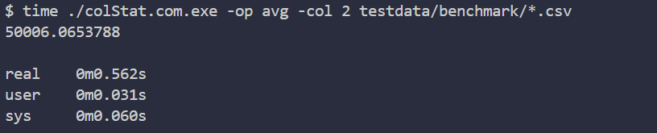
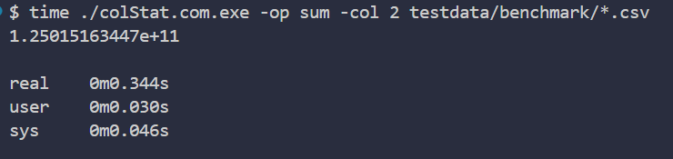
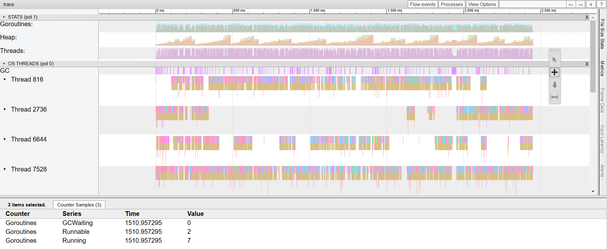
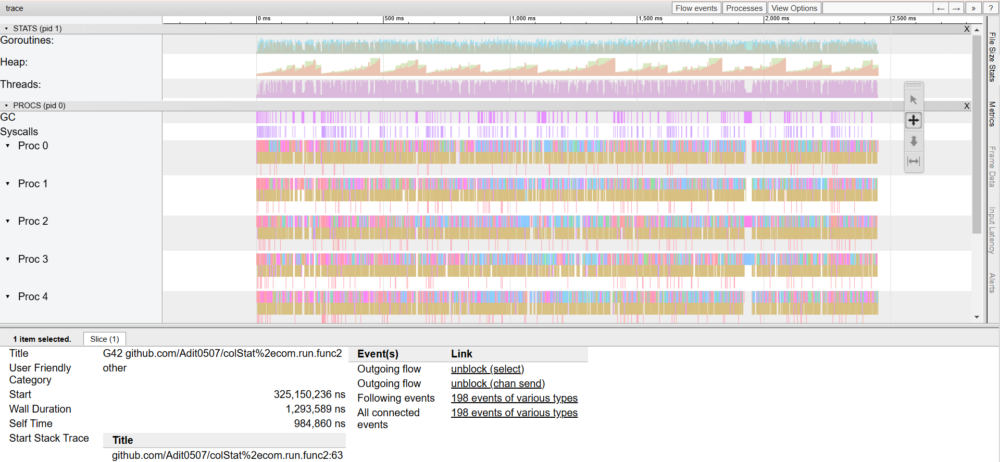

# colStat 

CLI Tool to execute statistical operation in A CSV file: average and sum operations for now

### Learning Objectives
- Learned about Benchmarking & Improving the Performance
- Analyzed performance by profiling and tracing

### OUTPUT

### TRACING

